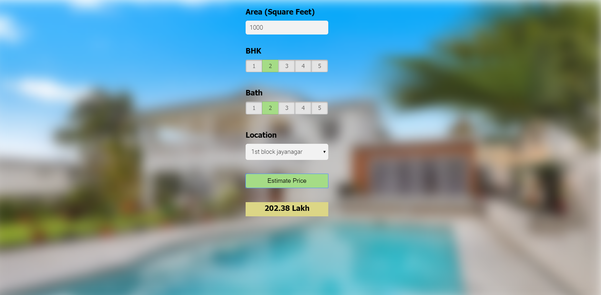

# Real-State-house-price-prediction

## This  project  walks through step by step process of how to build a real estate price prediction website. 
1. We will first build a model using sklearn and linear regression using banglore home prices dataset from kaggle.com. 
2. During model building we will cover almost all data science concepts such as data load and cleaning, outlier detection and removal, feature engineering, dimensionality reduction, gridsearchcv for hyperparameter tunning, k fold cross validation etc.
3. Second step would be to write a python flask server that uses the saved model to serve http requests. 
4. Third component is the website built in html, css and javascript that allows user to enter home square ft area, bedrooms etc
5.  it will call python flask server to retrieve the predicted price.  
## Technology and tools 
1.Python
2.Numpy and Pandas for data cleaning
3.Matplotlib for data visualization
4.Sklearn for model building
5.Jupyter notebook, visual studio code and pycharm as IDE
6.Python flask for http server
7.HTML/CSS/Javascript for UI

